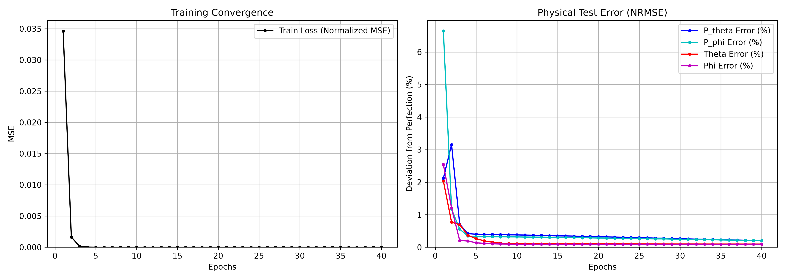
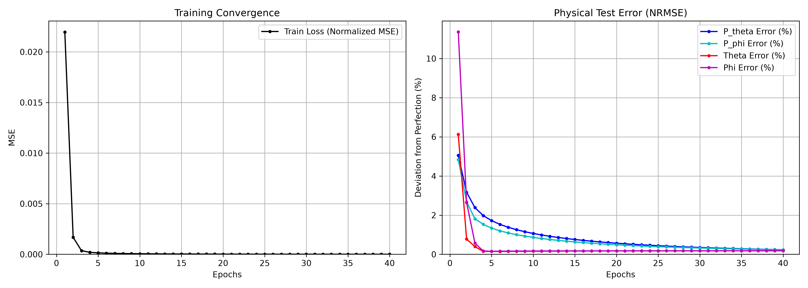

# MagNet
Predicting Tokamak guiding-center trajectories using PyTorch-based Symplectic Neural Networks (SympNet) trained on GORILLA simulation data.

**Dependencies:**
- PyTorch
- NumPy
- SciPy
- Matplotlib

---

## Project Status: Entering Phase 2 (Model Training)

### ✅ Phase 1: Data Generation (Complete)
- **High-Fidelity Ground Truth:** Successfully utilized the GORILLA (Guiding-center ORbit Integration with Local Linearization Approach) engine to generate baseline collisionless phase-space trajectories.
- **Optimized Pipeline:** Implemented a monolithic, memory-safe data pipeline that circumvents Fortran grid-allocation RAM spikes to natively batch and simulate 1,000 simultaneous particle orbits.
- **Canonical Flux Coordinates:** Extracted orbital data and manually isolated the canonical momentum variables $(P_\theta, P_\phi, \theta, \phi)$.
- **Mathematical Splining:** Post-processed the adaptive RK45 integrator outputs using cubic splines to resample the trajectories into perfectly uniform time-steps. The initial `unwrap-spline-wrap` algorithm introduced a $2\pi$ discontinuity that bounded residual networks could not fit. This was permanently resolved by keeping the angles strictly continuous (unwrapped), allowing the network to successfully map smooth $\Delta q$ residuals.
- **Symplectic Normalization:** Implemented Conformal Symplectic Scaling to reduce the phase space volume from $10^7$ down to $\mathcal{O}(1)$ without distorting the Hamiltonian geometry.

### ✅ Phase 2: Network Architecture (Complete)
- **Objective:** Construct and evaluate PyTorch-based Symplectic Neural Networks on Tokamak magnetic fields.
- **Magnetic Field Details:** The models are currently trained on collisionless guiding-center orbits generated by GORILLA. The underlying field uses the `i_orbit_options=3` configuration, which represents a standard axisymmetric Tokamak magnetic equilibrium field.
- **1-Step Prediction Results:** After correcting the dataset wraparound discontinuities, both architectures successfully captured the canonical geometry, achieving **<0.5% Normalized RMSE** across all variables on the test sets!
  - **LASympNet:** `P_theta: 0.204% | P_phi: 0.205% | theta: 0.097% | phi: 0.094%`
  - **GSympNet:** `P_theta: 0.233% | P_phi: 0.226% | theta: 0.182% | phi: 0.179%`
- **Inferences:** 
  1. **Accuracy:** LA-SympNet achieved slightly better absolute accuracy on the positional angle variables ($\theta, \phi$), dropping below $0.1\%$, whereas G-SympNet plateaued just under $0.2\%$.
  2. **Convergence:** Both models are extremely robust and mathematically sound. With the continuous dataset and proper weight initializations, the underlying symplectic formulation perfectly encapsulates the Tokamak phase space.

  
  

---

### 🚀 Phase 3: Future Directions
Now that the baseline 1-step models are validated, the project is moving into:
1. **Long-Horizon Rollouts & Energy Conservation:** Writing an auto-regressive inference loop to unroll predictions over 1000+ steps, proving the network strictly conserves canonical invariants (energy) over time compared to standard models.
2. **Time-Conditioned SympNets:** Modifying the network to accept $\Delta t$ as an explicit input to create a universal, continuous-time surrogate.
3. **Parameterized Hamiltonians:** Adding external control variables (like magnetic coil currents) as conditional inputs to act as a real-time digital twin.
4. **Ablation Studies:** Comparing LA vs. G architectures on highly chaotic edge-plasma turbulence.

---

### ⚠️ Note on GORILLA Modifications
In order to correctly train the SympNets, the neural network requires inputs to be perfectly *canonically conjugate* pairs. Because GORILLA natively outputs non-canonical tracking variables ($v_\parallel$ and $s$), we had to slightly modify its Fortran source code to explicitly compute the true canonical momenta.

Specifically, `GORILLA/SRC/supporting_functions_mod.f90` was modified to include `p_theta_func`, and `gorilla_plot_mod.f90` was modified so that the trajectory output file yields 7 columns instead of 5: `[t, s, theta, phi, vpar, P_theta, P_phi]`. If you clone a fresh version of GORILLA, you will need to re-apply these Fortran hacks to extract the canonical momenta.
